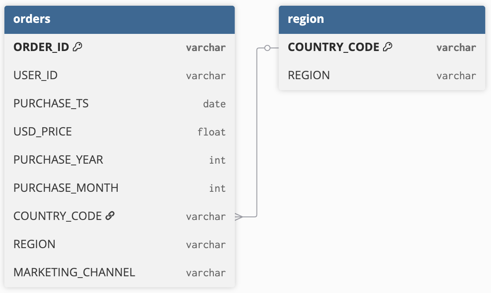

# Objective
This analysis was designed for Sales and Marketing leadership at **GameZone**, an e-commerce gaming retailer. The goal is to understand overall sales performance and growth patterns, and to highlight the key drivers across region, marketing channel, and product. The findings point to where the business should focus to sustain and accelerate growth.  

The first layer of analysis tracks monthly sales trends and month-on-month growth. This provides visibility into seasonality, demand cycles, and the momentum of growth across the years. These insights can guide campaign timing, inventory planning, and resource allocation.  

Building on this foundation, the second layer of analysis breaks down sales drivers across regions, marketing channels, and product categories. These insights inform strategic decisions around regional investment, channel prioritisation, and product strategy.  

# Data & Methodology  

## Data Structure  

The dataset consisted of two related tables. **Orders** contained transaction-level details such as purchase timestamps, prices, country codes, and marketing channels. **Region** mapped 'country_codes' to their corresponding regional groupings. The two tables were joined on 'country_code' to integrate regional information into the transaction data for analysis.

## Data Transformation and Augmentation  

Once joined, the data was prepared for analysis through a series of cleaning and transformation steps carried out in Excel. An issues log was maintained throughout this process to provide visibility and documentation of quality concerns. Key activities included:  
- Standardising date fields to ensure consistency across time-based analysis.  
- Recategorising inconsistent product names.  
- Handling missing values in the marketing channel and region fields.  
- Identifying duplicates and logical inconsistencies such as ship dates preceding purchase dates.  
- Logging unresolved anomalies (e.g., missing purchase timestamps, zero-dollar transactions) for stakeholder review.  
