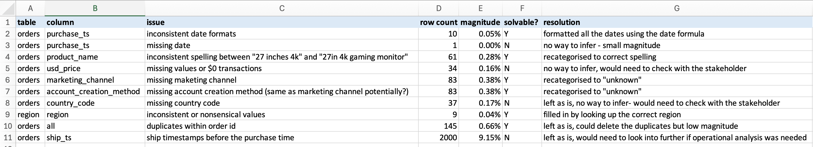
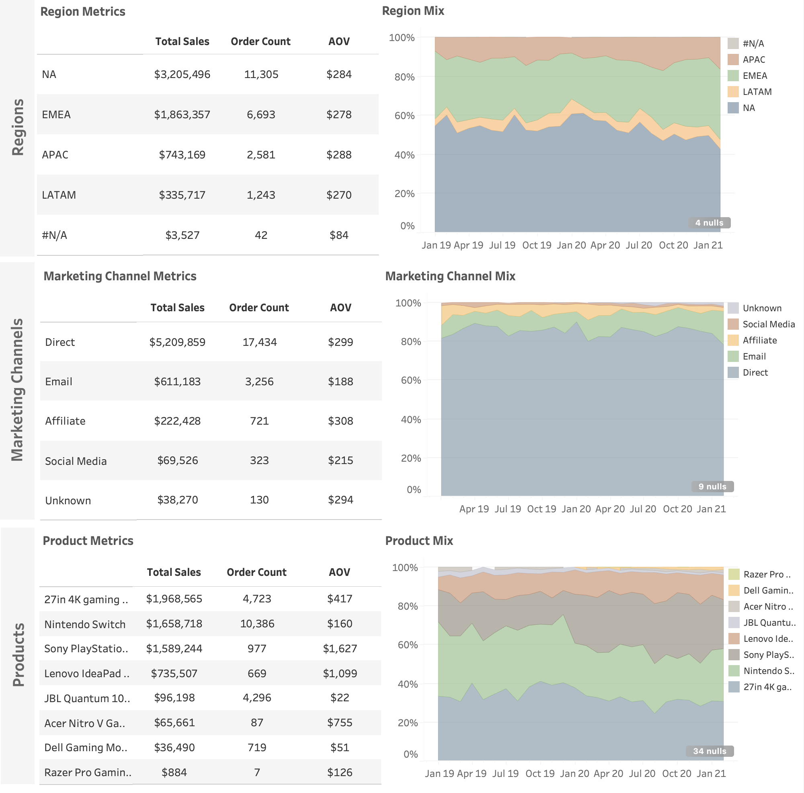

# Objective
This analysis was designed for Sales and Marketing leadership at **GameZone**, an e-commerce gaming retailer. The goal is to understand overall sales performance and growth patterns, and to highlight the key drivers across region, marketing channel, and product. The findings point to where the business should focus to sustain and accelerate growth.  

The first layer of analysis tracks monthly sales trends and month-on-month growth. This provides visibility into seasonality, demand cycles, and the momentum of growth across the years. These insights can guide campaign timing, inventory planning, and resource allocation.  

Building on this foundation, the second layer of analysis breaks down sales drivers across regions, marketing channels, and product categories. These insights inform strategic decisions around regional investment, channel prioritisation, and product strategy.  

# Data & Methodology  

## Data Structure  

The dataset consisted of two related tables. **Orders** contained transaction-level details such as purchase timestamps, prices, country codes, and marketing channels. **Region** contained country codes and their associated regional groupings. The two tables were joined on `country_code` to integrate regional information into the order data for analysis.

## Data Transformation and Augmentation  

Once joined, the data was prepared for analysis through a series of cleaning and transformation steps carried out in Excel. An issues log was maintained throughout this process to provide visibility and documentation of quality concerns. 

Key preparation steps included standardising date fields, aligning inconsistent product names, and recategorising missing marketing channel and account creation method values. Region assignments were verified against country codes, while unresolved anomalies such as blanks in country codes, duplicate order IDs, zero-dollar transactions, and purchase/ship timestamp inconsistencies were documented for stakeholder review.

# Analysis & Dashboards  

## 1. Sales Trends & MoM Performance  
  

- **Consistent Year-on-Year Growth:** Sales and order volumes both increased steadily from 2019 through 2021, with 2020 showing the strongest acceleration in Q1–Q2. Despite some dips, the overall trajectory indicates sustained demand growth in the e-commerce gaming market.  
- **Orders Driving Growth More Than AOV:** While sales and orders grew strongly, Average Order Value (AOV) remained relatively stable across the three years, fluctuating only modestly. This indicates that revenue growth is primarily driven by volume (number of orders), not higher spend per transaction.  
- **Strong Seasonal Spikes:** End-of-year peaks are evident, particularly in Q4, highlighting the importance of holiday seasonality as a recurring revenue driver. Sales in December reached their highest across the time series, confirming this as a critical planning period.  
- **Month-on-Month Fluctuations:** MoM heatmaps show high volatility, especially in early months (January–March) and around Q3. These fluctuations highlight periods of unpredictable demand, where forecasting accuracy and resource flexibility are essential.  
- **Volatility in Early 2021:** The first months of 2021 show sharper declines in both sales and orders (January–February), breaking the trend of strong early-year growth seen in 2020. This suggests a possible demand cooling or external disruption impacting momentum.  

## 2. Regional, Channel, and Product Drivers  
 

- **Regional concentration:** North America and EMEA dominate performance, together contributing the majority of sales and orders. APAC and LATAM remain secondary, while small volumes of missing codes (N/A) reflect limited data quality issues.  
- **Channel dominance:** Direct sales account for the bulk of revenue, supported at a smaller scale by Email. Email has lower AOV, pointing to more price-sensitive customers, while Affiliate and Social Media play only marginal roles.  
- **Product mix leaders:** Consoles (Nintendo Switch, PlayStation 5) and monitors (27in 4K gaming) drive the highest volumes and revenue. Variance in AOV is wide, from high-value laptops (Lenovo IdeaPad) to low-value accessories (JBL Quantum headset).  
- **Q4 uplift by category and region:** Seasonal holiday peaks are reinforced here, with NA and EMEA seeing stronger shares into Q4 and product demand concentrating around consoles and monitors. This aligns with the December spikes seen in overall sales trends.  

# Key Insights and Recommendations

### Seasonality & Demand Patterns  
- **Q4 remains the strongest driver of annual performance:** Sales peaks in December confirm the holiday season as a critical period requiring resource prioritisation and targeted campaigns.  
- **Early-year volatility presents risk:** Sharp dips and spikes in Q1 (Jan–Mar) create challenges for forecasting and revenue stability. This calls for proactive demand smoothing through promotions, staggered product launches, or campaigns designed to stabilise sales momentum.  

### Product Categories  
- **Consoles are the growth engine:** Strong, consistent performance makes this category central to revenue strategy. Continued investment in stock, promotions, and exclusive bundles will sustain momentum.  
- **Headsets and accessories underperform:** These categories lag behind overall growth. Options include repositioning (adjust pricing, marketing angle, or bundling with stronger products) or, if underperformance persists, diversifying into adjacent categories such as gaming furniture or VR peripherals.  

### Marketing Channels  
- **Direct marketing is the most effective channel:** Higher conversion rates and strong ROI justify further investment and optimisation.  
- **Lower-performing channels (e.g., affiliates) need scrutiny:** Either refine their targeting or reallocate spend to higher-yield channels.  

### Regions  
- **North America and EMEA are the strongest regions:** High sales and stable growth suggest further scaling efforts and continued focus.  
- **LATAM and APAC underperform relative to other regions:** These require careful monitoring, with selective investment in promising markets and cautious testing of new growth levers where performance lags.  

